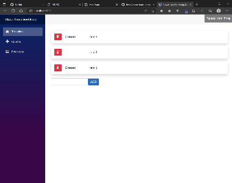

# Blazor Transition Group

English / [日本語](https://zenn.dev/remrem/articles/3e13d64bcba6b5)

Exposes simple components useful for defining entering and exiting transitions. 
it does not animate styles by itself. Instead it exposes transition stages, manages classes and group elements and manipulates the DOM in useful ways, making the implementation of actual visual transitions much easier.

This project is inspired from [React Transition Group](https://github.com/reactjs/react-transition-group).



Here is demo page.

https://le-nn.github.io/blazor-transition-group/

## Installation

```
dotnet add package BlazorTransitionGroup
```

Here is Nuget package link
https://www.nuget.org/packages/BlazorTransitionGroup

## Supported platform

.NET 7 or higher

## Components

### Transition

The Transition component lets you describe a transition from one component
state to another over time with a simple declarative API. 
Most commonly it's used to animate the mounting and unmounting of a component,
but can also be used to describe in-place transition states as well.

By default the Transition component does not alter the behavior of the component it renders, it only tracks "enter" and "exit" states for the components.
It's up to you to give meaning and effect to those states. For example we can add styles to a component when it enters or exits:

There are 4 main states a Transition can be in:

* ```entering```
* ```entered```
* ```exiting```
* ```exited```

Here is example of how to use Transition component

[Sample code is here](./samples/BlazorTransitionGroup.Samples/Demo/GrowTransition.razor)

Inherits ```BlazorTransitionGroup.Transition``` and override razor template as BuildRenderTree method.

```razor

// GrowTransition.razor
@using BlazorTransitionGroup

@inherits Transition

<div style="@ActualStyle" class="@Class">
    @ChildContent?.Invoke(TransitionState)
</div>

@code {
    string ActualStyle => $"opacity: {Opacity};transform:scale({Size});transition:opacity {Duration / 2}ms ease-in-out,transform {Duration}ms ease-in-out;{Style}";

    string Opacity => TransitionState switch {
        TransitionState.Entering or TransitionState.Entered => "1",
        _ => "0",
    };

    string Size => TransitionState switch {
        TransitionState.Entering or TransitionState.Entered => "1",
        _ => "0",
    };

    double Duration => TransitionState switch {
        TransitionState.Entering or TransitionState.Entered => DurationEnter,
        _ => DurationExit,
    };

    string HeightStyle => TransitionState switch {
        TransitionState.Entering or TransitionState.Entered => "100%",
        _ => "0%",
    };

    [Parameter]
    public string Height { get; set; } = "auto";

    [Parameter]
    public string Width { get; set; } = "auto";

    [Parameter]
    public string? Style { get; set; }

    [Parameter]
    public string? Class { get; set; }
}

```

### Public API Reference
| Name                | Type            | Category            | Default                | Description                                                 |
|---------------------|-----------------|---------------------|------------------------|-------------------------------------------------------------|
| ChildContent        | RenderFragment? | Component Attribute | null                   | The Render fragment for child content.                      |
| TransitionBegan     | EventCallback   | Component Attribute | ---                    | The event callback that fired when Transition is Began.     |
| TransitionCompleted | EventCallback   | Component Attribute | ---                    | The event callback that fired when Transition is Completed. |
| Delay               | int             | Component Attribute | 0                      | The milliseconds of deley time that animation begin.        |
| DurationEnter       | int             | Component Attribute | 400                    | The Duration of entering animation.                         |
| DurationExit        | int             | Component Attribute | 400                    | The Duration of exiting animation.                          |
| In                  | bool?           | Component Attribute | null                   | Is the animation enabled.                                   |
| IsAnimating         | bool            | Property            | false                  | Whether it is currently animated.                           |
| TransitionState     | TransitionState | Property            | TransitionState.Exited | The current transition state.                               |
| Dispose             | void Dispose()  | Method              | ---                    | Dispose current context.                                    |


### TransitionGroup

The ```<TransitionGroup>``` component manages a set of transition components
(```<Transition>```) in a list. 

Like with the transition components, ```<TransitionGroup>``` is a state machine for managing
the mounting and unmounting of components over time.

Consider the example below. 
As items are removed or added to the TodoList the
in prop is toggled automatically by the ```<TransitionGroup>```.

Note that ```<TransitionGroup>``` does not define any animation behavior!
Exactly how a list item animates is up to the individual transition component.
This means you can mix and match animations across different list items.

```TransitionGroup``` Component requires unique ```@key``` field.
The ```Transition``` Component to be animated must be placed directly under the ```TransitionGroup```.
It won't work if you wrap it in a ```div``` or other component.

OK
```razor
<TransitionGroup>
    @foreach(var item in items) {
       <HogeTransition @key="item" />
    }
</TransitionGroup>
```

Failed
```razor
<TransitionGroup>
    @foreach(var item in items) { 
        <div @key="item">
            <HogeTransition @key="item" />
        </div>
    }
</TransitionGroup>
```

[Sample code in Demo is here](./samples/BlazorTransitionGroup.Samples/Demo/TransitionDemo.razor)

```razor

@using BlazorTransitionGroup

<TransitionGroup>
    @foreach (var (i, text, id) in _items) {
        @if (i % 2 is 0) {
            <GrowTransition @key="@($"{text}-{id}")" Context="state">
                <div class="item d-flex p-3 align-items-center shadow mt-3 rounded-3 bg-white">
                    <button class="btn btn-danger" @onclick="@(() => Remove((i, text, id)))">
                        <i class="oi oi-trash" />
                    </button>
                    <div class="p-1 mx-3" style="width:100px;">@state</div>
                    <div class="p-1 mx-3">@text</div>
                </div>
            </GrowTransition>
        }
        else {
            <SlideTransition @key="@($"{text}-{id}")">
                <div class="item d-flex p-3 align-items-center shadow mt-3 rounded-3 bg-white">
                    <button class="btn btn-danger" @onclick="@(() => Remove((i, text, id)))">
                        <i class="oi oi-trash" />
                    </button>
                    <div class="p-1 mx-3" style="width:100px;"></div>
                    <div class="p-1 mx-3">@text</div>
                </div>
            </SlideTransition>
        }
    }
</TransitionGroup>

<div class="d-flex mt-4">
    <input @bind-value="_text " />
    <button class="btn btn-primary" @onclick="Add"> ADD</button>
</div>

@code {
    string _text = "";
    int _i = 3;

    List<(int Index, string Text, Guid Key)> _items = new() {
        (0, "item 1", Guid.NewGuid()),
        (1, "item 2", Guid.NewGuid()),
        (2, "item 3", Guid.NewGuid()),
    };

    void Add() {
        if (string.IsNullOrWhiteSpace(_text)) {
            return;
        }

        _items.Add((_i++, _text, Guid.NewGuid()));
        _text = "";
    }

    void Remove((int, string, Guid) text) {
        _items.Remove(text);
    }
}

```

### Public API Reference
| Name          | Type               | Description                                                         |  
| ------------- | ------------------ | ------------------------------------------------------------------- |
| ChildContent  | RenderFragment?    | The render fragment for ChildContent.                               |

### TransitionBase

Another option to implements transition is to inherit ```TransitionBase```.
Transition can be implemented with composition.

RenderFragment context provider stransition state.


[Sample code in Demo is here](./samples/BlazorTransitionGroup.Samples/Demo/SlideTransition.razor)

Here is example of how to use Transition component.
Don't forget to specify the Key as a Transition Attribute.

```razor

@using BlazorTransitionGroup

@inherits TransitionBase

<Transition Key="Key" Context="transitionState">
    <div style="@(GetActualStyle(transitionState))" class="@Class">
        @ChildContent
    </div>
</Transition>

@code {
    string GetActualStyle(TransitionState state) {
        var (x, opacity) = (GetX(state), GetOpacity(state));
        return $"opacity: {opacity};transform:translateX({x});transition:opacity {Duration / 2}ms ease-in-out,transform {Duration}ms ease-in-out;{Style}";
    }

    string GetOpacity(TransitionState state) {
        return state switch {
            TransitionState.Entering or TransitionState.Entered => "1",
            _ => "0",
        };
    }

    double Duration => 800;

    string GetX(TransitionState state) {
        return state switch {
            TransitionState.Entering or TransitionState.Entered => "0%",
            _ => "-50%",
        };
    }

    [Parameter]
    public string? Style { get; set; }

    [Parameter]
    public string? Class { get; set; }

    [Parameter]
    public RenderFragment? ChildContent { get; set; }
}

```
### Public API Reference
| Name          | Type       | Description                                                         |  
| ------------- | ---------- | ------------------------------------------------------------------- |
| Key           | object?    | Gets or sets the key property to detect that should play animation. |

## Implementation

Due to the difference in the structure of the Virtual DOM Tree between React and Blazor, it is not possible to easily achieve what is done in react-transition-group in Blazor.
When representing nested components in React, the nodes of the RenderTree (children: ReactNode[]) can be touched directly,
When building the tree, the map function can be used to
The tree can be easily filtered or cached in a separate array.
Blazor is not so straightforward.
There is a fundamental difference between ReactNode in React and RenderFragment in Blazor.
Blazor does not have a way to directly handle RenderTree items like ReactNode does.
This is because Blazor's RenderFragment is a Delegate.

React
```jsx
function Component(props) {
  return (
    <div>
        {props.children} // ReactNode array
    </div>
  );
}
```

Blazor
```razor
<div>
@ChildContent // Delegate
</div>
@code {
    RenderFragment? ChildContent { get; set; }
}
```

So I decided to create a wrapper that further wraps the Virtual DOM Tree (RenderTreeFrames) generated by the framework, and then
I decided to restore the deleted nodes by lazy build.

First, by re-evaluating the one-dimensional array of RenderTreeFrames from the RenderTreeBuilder, a wrapper was created to represent them as a tree structure.
First, a wrapper is created and cached to represent it as a tree structure by re-evaluating the RenderTreeFrame, a 1D array from RenderTreeBuilder.

Next, when the state of the tree is updated, the cached RenderTreeFrame is re-evaluated.
2. the next time the state of the tree is updated, the cached RenderTreeFrame wrapper is used again to reconstruct the tree according to the conditions.

The new RenderTreeBuilder can then be rendered to the View.
When a tree is updated, even if it has been removed from the RenderTreeBuilder
The node where the animation is taking place (the child component) will be restored from the cache and the Frame will be rendered to the View.
The node that is animating (child component) can restore the Frame from the cache and wait until the animation is finished.

Wrapper to restore deleted nodes (RenderFrameBuilder)

https://github.com/le-nn/blazor-transition-group/blob/main/src/BlazorTransitionGroup/Internal/RenderFrameBuilder.cs#L91

Function to create RenderFrameBuilder

https://github.com/le-nn/blazor-transition-group/blob/main/src/BlazorTransitionGroup/TransitionGroup.cs#L120

Currently, transition cannot work unless it is placed directly under TransitionGroup, so it is not possible to completely reproduce react-transition-group.
In addition, a wrapper for the RenderTree is created and the RenderTreeFrame is rebuilt, so some performance sacrifices must be made.
However, we measured the render time for a ``TransitionGroup`` with more than 200 items and a few complex child components in less than a few milliseconds, so we assume that the overhead is negligible.
Function to create a RenderFrameBuilder

### Conclusion
The experience will be similar to react-transition-group, which will be very useful for declarative animations.
It will be very useful to realize animation in a declarative way 😎

# License
Designed with ❤️ by le-nn. Licensed under the MIT License.
